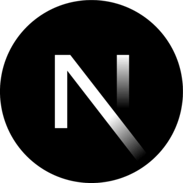
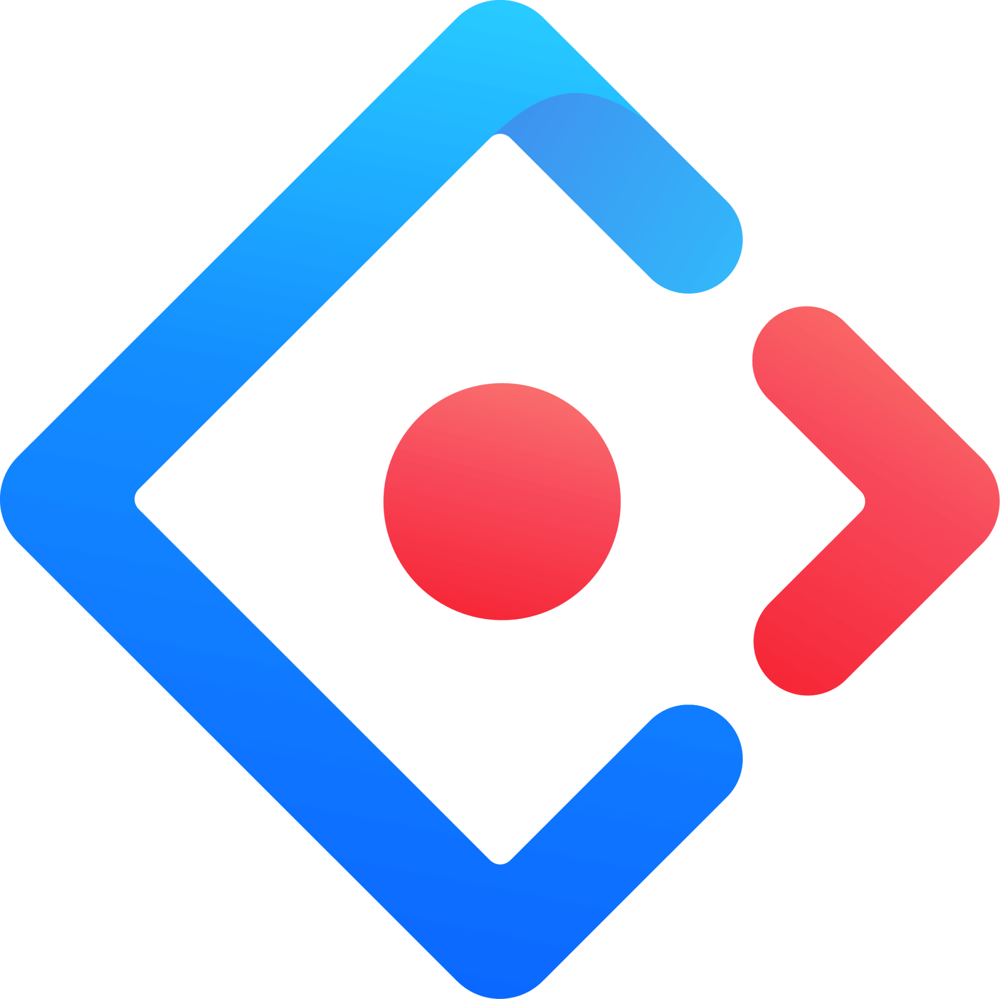
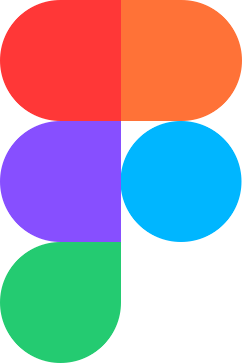

## Project template
```HTML
<li id="project_$PROJECT$">
    <div class="card glassy">
        <header>
            <div>
                
                <h2>$PROJECT$</h2>
            </div>
            <div class="links-container">
                <a href="#project_$project$" onclick="copyCurrentURL()">
                    <i class="fi fi-rr-link"></i>
                </a>
            </div>
        </header>
        <div class="description">
            <p>Lorem ipsum dolor sit amet <a class="extend_button">Voir plus</a></p>
            <h3>Title : </h3>
        </div>
        <footer>
            <div class="info_container">
                <div class="time">
                    <i class="fi fi-rr-clock-five"></i>
                    <p>TIMEh</p>
                </div>
                <div class="date">
                    <i class="fi fi-rr-calendar"></i>
                    <p>YEAR</p>
                </div>
            </div>
            <div class="tech_container">
                <a href="https://typescriptlang.org" target="_blank">
                    </a>
            </div>
        </footer>
    </div>
    
    <svg class="background" viewBox="0 0 100 100" preserveAspectRatio="xMidYMin slice">
        <circle class="light" cx="78" cy="35" r="25" style="fill: #fff; opacity: 0.6"/>
        <circle class="sphere" cx="78" cy="35" r="25"/>
    </svg>
</li>
```


## Techno templates

NextJs
```HTML
<a href="https://nextjs.org" target="_blank"></a>
```
Antd
```HTML
<a href="https://ant.design" target="_blank"></a>
```
TS
```HTML
<a href="https://typescriptlang.org" target="_blank"></a>
```
## Techno card
Figma
```HTML
<a class="techno_card" href="https://www.figma.com/fr-fr/" target="_blank">
    
    Figma
</a>
```
Nextjs
```HTML
<a class="techno_card" href="https://nextjs.org" target="_blank">
    
    Next.js
</a>
```
React
```HTML
<a class="techno_card" href="https://react.com" target="_blank">
    
    React
</a>
```
Node
```HTML
<a class="techno_card" href="https://nodejs.org/fr" target="_blank">
    
    NodeJs
</a>
```
Github
```HTML
<a class="techno_card" href="https://github.com" target="_blank">
    
    Github
</a>
```
```HTML
<a class="techno_card" href="https://ant.design" target="_blank">
    
    Ant design
</a>
```